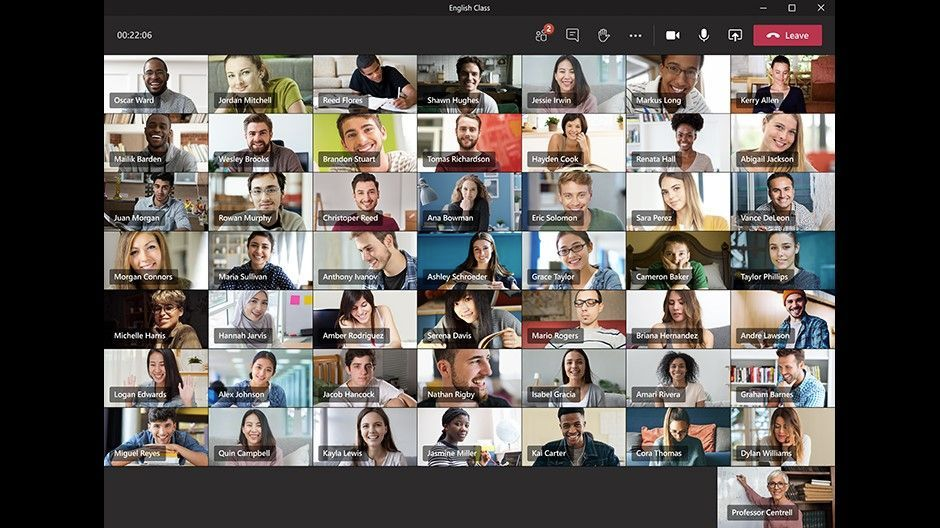

# Microsoft Teams 及其发展

## Microsoft Teams 诞生的背景和战略意义

我在本书的序言中提到 Microsoft Teams 出现的一些背景信息。2016年左右，微软的Office 365 已经取得初步的成功，作为公司核心的三朵云之一，服务于越来越多的企业客户，包括很多从传统的Office Server，以及本地客户端升级过来的客户。

> Microsoft Azure, Office 365, Dynamics 365 是当时的三驾马车，现在Office 365这个品牌已经升级为 Microsoft 365， 另外还要加上Power Platform这第四朵云。

熟悉微软的朋友们可能知道，这次起源于2010年前后的向云转型的过程，是一次充满未知的巨大冒险。当时的情形大致是，Windows 和 Office 一如既往取得了不错的成绩，但在搜索、互联网、社交、移动入口等这些领域面临的挑战也是前所未有的。

向云转型并不容易，对微软来说也有利有弊。构建云计算平台和服务需要大量基础建设，前期投入非常大，短期内可能见不到经济效益。好在微软本身有很强大的技术底蕴，和忠实的客户群体。现在回过头去看看Office 365一路走过来的过程，我总结是有三个主要的阶段：

1. 云化
2. 服务化
3. 平台化

**云化是第一步**。微软有非常成功的Office客户端软件家族，以及多个企业级服务产品（Exchange Server，SharePoint Server，和 Lync Server—— 后来改名为 Skype for Business Server），那么既然要做云中的Office，就需要把这些软件都搬到云端去吧。有条件咱要上，没有条件咱创造条件也要上啊。

技术上说，这个阶段的目标就是整合上面提到的三个服务器产品，加上Office Online Server，让用户可以通过一个账号就能访问这些服务，并且无缝地沟通和协作。这是SaaS服务的早期阶段，对终端用户来说，其实感受的变化不是很大，因为除了账号少了一些，服务还是那些服务，该怎么操作还是要怎么操作。但对于信息管理部门来说则已经意味着改变，安装和维护服务器不再是日常的主要工作，规划和管理用户及授权，合理分配资源，在效能和安全之间取得平衡等等成为了新的话题。

**服务化是必然趋势**。Office 365既然是SaaS应用，就要体现出来“软件即服务——Software as a Service”的特点，其中一个基本的要求就是，它所提供的能力，最好能以颗粒度更小的形式提供，并且允许客户自己的需求进行组合购买，仅为它购买的那部分服务付费。这个阶段把一些模块从三大服务组中分离出来，例如OneDrive for Business，Videos就是一个非常成功的例子，与此同时推出了更多全新的服务，包括本书的主角Microsoft Teams，以及下面列出的这些服务（仅为部分）。

**平台化的战略和两大抓手**。作为一个云服务，Office 365 用户日常使用会产生大量的数据，如何让这些数据能被客户自身（或通过可信的合作伙伴）加以利用甚至跟客户自身的应用进行整合呢？微软在2015年的build大会上，正式发布了Microsoft Graph 这个服务，通过一个统一的地址（[https://graph.microsoft.com](https://graph.microsoft.com)），使用最流行的REST API（以及各种SDK）的方式可以方便并且安全地访问这些有价值的数据。这是Office 365走向平台的一个重要举措，Microsoft Graph 作为平台在云端能力的一种集中体现，但微软似乎还需要一个能够广泛触达到用户的应用，并且支持合作伙伴或用户直接基于这个应用进行定制或扩展，实现更多价值。

> 2015年宣布Microsoft Graph的视频在这里 [https://channel9.msdn.com/Events/Build/2015/KEY01](https://channel9.msdn.com/Events/Build/2015/KEY01)

.png>)

我想，Microsoft Teams 就是在这样的大背景下诞生的。一方面，用户需要有更加现代的沟通协作体验，Skype for Business作为传统的企业级应用，功能相对有限无法满足用户的需求，也很难跟市场上新出现的一些对手做竞争。另外，Office 365有那么多服务，各种客户端，如何集中起来为用户提供平台服务，和Microsoft Graph搭档起来，从云+端（Cloud+Edge) 两个角度形成一套完整的平台？这个使命，至少目前看来，是落在了Microsoft Teams身上了。

## Microsoft Teams 和Office 365其他产品的关系

即便是如此，从Microsoft Teams 面世第一天开始，也伴随着各种疑问，其中被客户问的最多的问题就是：Office 365已经有Outlook，Skype for Business等全系列产品可以做沟通与协作，那么Teams 的具体定位是什么呢？

.png>)

Microsoft Teams为团队而生，它天生具备的功能就包括了聊天，音视频会议，以及共享文件和协作。作为一个现代版的工具，它也具备一定社交化的功能。这些功能和原先的Outlook，Skype for Business, SharePoint 和OneDrive，以及Yammer都有重叠。但是Teams 并不是重新开发这些功能，而是直接将他们整合进来，用户可以仅仅通过一个应用，即可以完成全方位的沟通和协作，除了收发邮件。

下面这一张图进一步解释了这种关系

.png>)

> 以上这张截图来自于官方文档 [https://techcommunity.microsoft.com/t5/microsoft-teams/new-teams-it-architecture-posters-published/m-p/480928](https://techcommunity.microsoft.com/t5/microsoft-teams/new-teams-it-architecture-posters-published/m-p/480928)，仅提供英文版本。链接网页中还有其他一些很有参考价值的架构图。

为什么Microsoft Teams不把邮件的功能也整合进来呢？ 这是由于邮件这种沟通方式，和Microsoft Teams所主张的（也是业界目前推崇的）“基于对话的沟通”是两种不同的方式。邮件并没有过时，它仍然适合于很多正式的、私密性的沟通，包括内部和外部。但很多时候用邮件就会显得很臃肿并且麻烦，例如在团队讨论一个活动的安排，来来回回几十个邮件，沟通效率极低，甚至让人厌烦，你会觉得这种方式真的像远古时代的恐龙那样笨重。市场总是需要一些新的东西，主要是社会发展的需要（人类的沟通协作方式在发生肉眼可见的变化），另外一小部分是由于商业的需要。

不去重复做已经有的东西，快速地把核心的框架搭建起来，并且投放到市场去接受检验，并且快速地进行迭代开发，这就是Microsoft Teams 能成为微软历史上成长速度最快的应用的原因。

> 关于Microsoft Teams 成为微软历史上成长速度最快的应用的说法，请参考官方文档 [https://pulse.microsoft.com/en/work-productivity-en/na/fa2-reasons-why-you-should-start-using-microsoft-teams-today/](https://pulse.microsoft.com/en/work-productivity-en/na/fa2-reasons-why-you-should-start-using-microsoft-teams-today/) 的第一段。

我很难说，一开始Microsoft Teams就是奔着做平台而去的，毕竟最开始的目标是要让这个应用能够成功，然后才能谈所谓的平台。但这种全新的开发方式（当然也是有赖于微软既有的这些成功的资产），某种程度上决定了Microsoft Teams有可能成长为一个平台。

到底为什么它能如此快速成长呢，下面通过回顾一下它的主要里程碑，管中窥豹了解一下吧。

## Microsoft Teams 主要里程碑

万丈高楼平地起，在Microsoft Teams发布大约4年后的今天，我帮助大家梳理和回顾一下它的一些主要里程碑，从中或许可以看出一些规律。

1. **2017年3月14日，Microsoft Teams 正式对全球客户可用。**当时的官方发布会邀请，你可以通过这里找到。[https://www.microsoft.com/en-us/microsoft-365/blog/2017/03/07/join-us-for-an-online-event-to-celebrate-the-global-availability-of-microsoft-teams/](https://www.microsoft.com/en-us/microsoft-365/blog/2017/03/07/join-us-for-an-online-event-to-celebrate-the-global-availability-of-microsoft-teams/) （英文）。
2. 2017年6月，为教育用户而单独设计的Microsoft Teams 首次亮相。
3. 2017年9月，使用人工智能技术优化的音视频会议体验推出。
4. **2018年3月12日，微软发布Microsoft Teams一周年成绩单**：在这一年中，Teams 在新功能和客户使用量方面都取得了显着提升。现在，181 个市场的 20 万个组织和 39 种语言在使用 Teams，包括 A.P. Moller–Maersk、ConocoPhillips、通用汽车、梅西百货、NASCAR、Navistar、RLH Corporation 和 Technicolor。详情请参考 [https://www.microsoft.com/zh-cn/microsoft-365/blog/2018/03/12/microsoft-teams-turns-1-advances-vision-for-intelligent-communications/](https://www.microsoft.com/zh-cn/microsoft-365/blog/2018/03/12/microsoft-teams-turns-1-advances-vision-for-intelligent-communications/)&#x20;
5. 2018年7月，政府专用版 Microsoft Teams 上线 （美国）。
6. **2018年7月12日，微软发布免费版本的Microsoft Teams**。这个版本拥有几乎全部的功能，而且承诺永远不收费，秉持微软一贯的原则，不会有任何广告等额外的东西。免费版本的组织规模最多可以300人，另外在存储容量方面有一些限制，你可以在任何时候轻松升级到商业版。详情请参考 [https://techcommunity.microsoft.com/t5/microsoft-teams-blog/introducing-a-free-version-of-microsoft-teams/ba-p/214592](https://techcommunity.microsoft.com/t5/microsoft-teams-blog/introducing-a-free-version-of-microsoft-teams/ba-p/214592) （英文）。如果你想体验免费版，请参考Tony的一个文章：[https://tony-xia.github.io/free-teams-hands-on/](https://tony-xia.github.io/free-teams-hands-on/)。
7. **2018年12月10日，据第三方独立机构（Spiceworks）进行的调查表明，Microsoft Teams 在市场占有率方面已经明显超过Slack**，从2016年的3%左右，上升到2018年底的21%，而Slack在两年多时间内的市场占有率仅从13%攀升到15%。数据表明，Office 365家族中的Skype for Business仍然占据主要的市场份额，约为44%。详情请参考 [https://community.spiceworks.com/blog/3157-business-chat-apps-in-2018-top-players-and-adoption-plans](https://community.spiceworks.com/blog/3157-business-chat-apps-in-2018-top-players-and-adoption-plans) (英文）。
8. 2019年1月，Microsoft Teams 增加了一系列针对一线工作者的功能。
9. 2019年2月，Microsoft Teams 增加了一系列针对医疗服务场景的功能。
10. **2019年7月，Microsoft Teams 的月度活跃用户数 （MAU) 达到1300万**，并且延续了对Slack的竞争优势。详情请参考 [https://www.microsoft.com/en-us/microsoft-365/blog/2019/07/11/microsoft-teams-reaches-13-million-daily-active-users-introduces-4-new-ways-for-teams-to-work-better-together/](https://www.microsoft.com/en-us/microsoft-365/blog/2019/07/11/microsoft-teams-reaches-13-million-daily-active-users-introduces-4-new-ways-for-teams-to-work-better-together/) （英文）。
11. 2019年11月，Microsoft Teams 的月度活跃用户数达到2000万。
12. 2020年3月（三周年），Microsoft Teams 的月度活跃用户数达到4400万。官方有一个文章，请参考 [https://www.microsoft.com/en-us/microsoft-365/blog/2020/03/19/microsoft-teams-3-everything-you-need-connect-teammates-be-more-productive/](https://www.microsoft.com/en-us/microsoft-365/blog/2020/03/19/microsoft-teams-3-everything-you-need-connect-teammates-be-more-productive/) （英文）。
13. **2020年4月，在一个月左右的时间内，Microsoft Teams 的月度活跃用户数几乎翻倍增长，达到7500万。**[https://www.microsoft.com/en-us/microsoft-365/blog/2020/04/30/2-years-digital-transformation-2-months/](https://www.microsoft.com/en-us/microsoft-365/blog/2020/04/30/2-years-digital-transformation-2-months/) （英文）
14. **2020年10月28日，Microsoft Teams的月度活跃用户数 (MAU) 达到1.15亿。**详情请参考 [https://www.microsoft.com/en-us/microsoft-365/blog/2020/10/28/microsoft-teams-reaches-115-million-dau-plus-a-new-daily-collaboration-minutes-metric-for-microsoft-365/](https://www.microsoft.com/en-us/microsoft-365/blog/2020/10/28/microsoft-teams-reaches-115-million-dau-plus-a-new-daily-collaboration-minutes-metric-for-microsoft-365/) （英文）。
15. 2021年4月，Microsoft Teams 的月度活跃用户（MAU）达到1.45亿。
16. **2021年7月，Microsoft Teams的 月度活跃用户（MAU) 达到2.5亿。**

从上面的路线图可以看出来，自面世以来，Microsoft Teams 在同Slack为首的外部产品，以及Skype for Business的内部产品竞争过程中，既依托和巩固既有的阵地，并且大胆地创新（尤其是在人工智能方面的发力），从2018年一举超越Slack后，一直稳步增长。而由于全球突然爆发的疫情，在2020年更是实现了井喷式的爆发，疫情之下，已经不仅仅是商业考虑，满足客户需求有时候更是责任所在。根据不断涌现的各种各样的需求，一方面调整既有的开发节奏，快速地发布新功能，另一方面面对潮水一样的使用量，Microsoft Teams 平台经受住了考验，这方面我是亲身经历，感触特别深。下面我也想简单地总结一下在疫情期间的挑战和机遇。

## 疫情期间的挑战和机遇

在没有任何心理准备的情况下，2020年春节前后，全球爆发了新型冠状病毒的疫情，而且绝大部分人都想不到这次疫情会要持续这么久，直到现在这股阴云还笼罩在我们头顶。

在度过早期的彷徨之后，所有人都要面临着工作和生活如何继续的问题。大量的传统工厂无法开业，实体经济遭受重创，而越来越多的企业都开始了各种形式的远程工作的艰苦努力，以便尽可能地恢复运行。

但是影响最大的，我觉得是教育领域。因为一般来说，企业或多或少在信息化层面的投入是具备一定基础的，但学校，一方面是重度依赖线下面对面教学的机构，千百年来都是如此，就算是到了二十一世纪，其信息技术的普及度也相对较低，而相比较企业的停工，教育又不能随随便便中断。

现有的一些学习管理系统（LMS）大多专注于辅助教学和数据管理等方面，而一旦学生无法到校学习，这套机制就无法工作了，因为其中最关键的教学授课的场景缺失了，其他的都无从谈起。所以，2020年的这一波疫情，可以说历史性地改变了我们对于教育模式的认知，并且提出了全新的命题，以便应对学生有可能无法到校学习的场景。同样对于包括微软在内的行业厂商来说，既是一个发展机遇，更多的也是一份很重的担子。

首先要解决的问题在于，如何快速满足视频上课的场景。Microsoft Teams有视频会议的功能，这本身不是一个问题，问题在于学校的视频上课场景，跟企业视频会议的场景不一样。为了营造出来所有人都在教室，相互能看到彼此的氛围，这就要求所有人都能打开视频，并且最好同时都能显示出来。现有的功能是允许最多同时显示3\*3（一共9个）视频，这在企业开会的场景中大多是够用的。但学校上课要求更多。Microsoft Teams的产品团队决定调整现有的开发计划，把教育行业的这些需求列为高优先级，迎头赶上，在两三月内的时间，开发出来4\*4（一共16路视频），和7\*7（一共49路视频）等重要功能。

下面这个发表于2020年6月份的文章，你可以看到多达20项，针对教育行业各类创新的介绍。

<https://techcommunity.microsoft.com/t5/education-blog/20-updates-for-microsoft-teams-for-education-including-7x7-video/ba-p/1457748>

而仅在2020年4月统计到的数据，每天全世界的用户通过Microsoft Teams 召集的在线会议达到2亿次，视频会议的时长达到了41亿分钟。这其中也包括了很多中国的知名院校，培训机构，甚至中小学。

有一些技术背景的朋友肯定是知道，音视频会议这种功能是资源密集型的，对网络带宽，服务器资源都有较之一般应用更高的需求。所以，推出新功能是一方面，随着蜂拥而至的用户和日常高频地使用量，对平台服务的容量伸缩性和稳定可靠性等方面也提出了很大的挑战。让我说的直白一点，这些功能是很烧钱的，而正好在教育领域呢，微软是收费很低，甚至免费的。我只是想通过这一个对比，适当解释企业要承担的社会责任吧。

相较于上面提到的大量教育领域的场景，是解决从无到有的一个问题。在商业领域，绝大部分人的工作形式也随着疫情发生了显著而深刻的变化，越来越多的人在家办公，越来越多的客户活动也都改到了线上，连世界性的体育活动，也没有了观众。如何让人们在远程沟通和协作时，仍然能感受到相互的联系，这是一个全新的课题。

我很高兴地看到Microsoft Teams利用人工智能的技术，重新定义了视频会议的边界，例如下图所示的场景是NBA官方跟微软的一个合作，通过Together mode（“在一起”模式），让NBA粉丝们可以身临其境地观看比赛，也让球员能够在场上享受粉丝的欢呼，正如他们就在身边一样。技术可以用来做美颜（或许会让用户自己更“开心”），也可以用来真正改善人们相互之间的联系，并且更好地支持彼此。这是两个层面的设计理念。

关于NBA这个合作的详细信息，请参考官方文档 [https://www.microsoft.com/en-us/microsoft-365/blog/2020/07/24/reimagining-teams-experience-basketball-microsoft-teams/](https://www.microsoft.com/en-us/microsoft-365/blog/2020/07/24/reimagining-teams-experience-basketball-microsoft-teams/)（英文）。

.png>)

在2021年3月份举行的Microsoft Ignite大会上，Microsoft Teams 又发布了一系列新功能，你可以通过下面的链接了解详情。

<https://techcommunity.microsoft.com/t5/microsoft-teams-blog/what-s-new-in-microsoft-teams-microsoft-ignite-2021/ba-p/2118226>

依托于强大的Azure 平台架构，以及大量成熟的技术（大量的技术专利），在渡过前期一段也可以称得上焦头烂额的时间后，快速地开发出来很多新的功能，并按需扩展了数据中心的容量和网络带宽，并且始终把客户的安全和合规等底线坚守住，赢得了越来越多客户的认可和信任。

## 产品路线图

Microsoft Teams 的开发采用的是互联网行业流行的敏捷开发和DevOps实践，几乎每月都有新的功能发布出来，并且通过一套成熟的机制推送给不同层（Ring）的用户。

你可以随时通过 [https://www.microsoft.com/zh-cn/microsoft-365/roadmap?filters=Microsoft%20Teams](https://www.microsoft.com/zh-cn/microsoft-365/roadmap?filters=Microsoft%20Teams) 了解到Microsoft Teams的路线图。你也可以把这个地址 [https://www.microsoft.com/zh-cn/microsoft-365/RoadmapFeatureRSS/](https://www.microsoft.com/zh-cn/microsoft-365/RoadmapFeatureRSS/) 加入到RSS阅读器（例如Outlook），以便随时收到最新的功能通知。

.png>)

> 截图于 2021-4-19日

这一小节给大家比较系统性地介绍了 Microsoft Teams 产生的背景，和Office 365现有产品之间的关系，以及一路发展的主要历程。接下来就来谈一谈从平台的角度来说，它是怎么设想和定位的。
